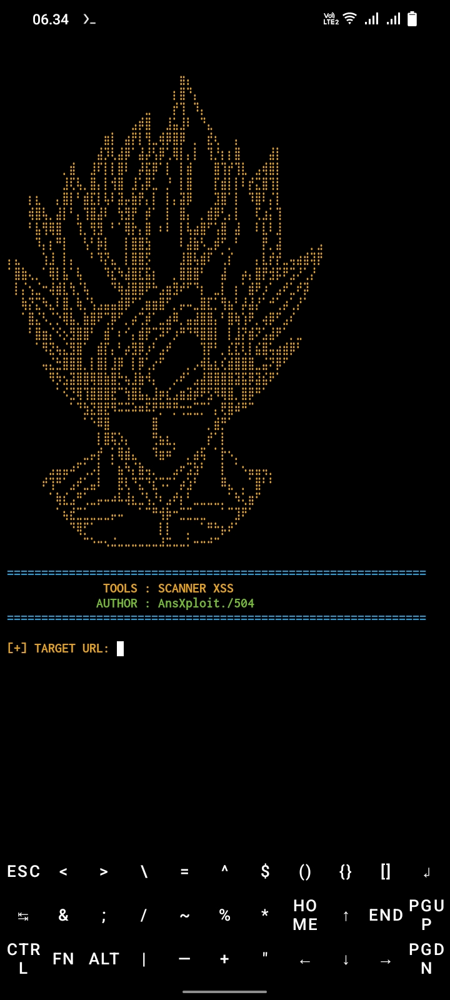

🔥 ScanXSS

 "Python" (https://img.shields.io/badge/Python-3.x-blue?style=for-the-badge&logo=python)
"Version" (https://img.shields.io/badge/Version-1.0-red?style=for-the-badge)
"Platform" (https://img.shields.io/badge/Platform-Termux-green?style=for-the-badge)
"Status" (https://img.shields.io/badge/Status-Active-success?style=for-the-badge)

---

⚡ Loading Preview

[■■□□□□□□□□] 20%
[■■■■□□□□□□] 40%
[■■■■■■□□□□] 60%
[■■■■■■■■□□] 80%
[■■■■■■■■■■] 100%

Initializing ScanXSS...
Loading Payload Database...
Preparing Scanner Engine...
Scanner Ready ✔

---

🚀 About

ScanXSS adalah tool berbasis Python yang digunakan untuk membantu menemukan parameter input yang berpotensi rentan terhadap Cross Site Scripting (XSS).

Features

- 🔍 Fast Parameter Discovery
- ⚡ Lightweight
- 📜 Multiple Parameter Support
- 🎯 Single Target Scan
- 📱 Termux Supported
- 🐍 Python Based

---

tool :

---

📦 Installation

pkg update -y && pkg upgrade -y

pkg install git python -y

git clone https://github.com/AnsThub/scanxss.git

cd scanxss

python scanxss.py

---

🎮 Usage

python scanxss.py

Contoh:

https://target.com/search?q=test

---

🔎 PARAMETER DISCOVERY REFERENCE

==================================================================
DORK PARAMETER UMUM
==================================================================

inurl:?q=
inurl:?s=
inurl:?search=
inurl:?query=
inurl:?keyword=
inurl:?id=
inurl:?page=
inurl:?cat=
inurl:?user=
inurl:?name=
inurl:?msg=
inurl:?comment=

==================================================================
DORK SITE .ID (INDONESIA)
==================================================================

inurl:?q= site:.id
inurl:?search= site:.id
inurl:?id= site:.id
inurl:?page= site:.id
inurl:?s= site:.id
inurl:?keyword= site:.id
inurl:?cat= site:.id
inurl:?user= site:.id

==================================================================
DORK SITE .CO.ID
==================================================================

inurl:?q= site:.co.id
inurl:?search= site:.co.id
inurl:?id= site:.co.id
inurl:?page= site:.co.id

==================================================================
DORK SITE .GO.ID
==================================================================

inurl:?q= site:.go.id
inurl:?search= site:.go.id
inurl:?id= site:.go.id
inurl:?page= site:.go.id

==================================================================
DORK SITE .AC.ID
==================================================================

inurl:?q= site:.ac.id
inurl:?search= site:.ac.id
inurl:?id= site:.ac.id
inurl:?page= site:.ac.id

==================================================================
DORK SITE .COM
==================================================================

inurl:?q= site:.com
inurl:?search= site:.com
inurl:?id= site:.com
inurl:?page= site:.com
inurl:?s= site:.com
inurl:?query= site:.com

==================================================================
DORK SITE .ORG
==================================================================

inurl:?q= site:.org
inurl:?search= site:.org
inurl:?id= site:.org
inurl:?page= site:.org

==================================================================
DORK SITE .NET
==================================================================

inurl:?q= site:.net
inurl:?search= site:.net
inurl:?id= site:.net

==================================================================
DORK SITE .MY
==================================================================

inurl:?q= site:.my
inurl:?search= site:.my
inurl:?id= site:.my

==================================================================
DORK SITE .SG
==================================================================

inurl:?q= site:.sg
inurl:?search= site:.sg
inurl:?id= site:.sg

==================================================================
DORK SITE .PH
==================================================================

inurl:?q= site:.ph
inurl:?search= site:.ph
inurl:?id= site:.ph

==================================================================
DORK SITE .TH
==================================================================

inurl:?q= site:.th
inurl:?search= site:.th
inurl:?id= site:.th

---

👨‍💻 Author

Author  : AnsXploit
Tool    : ScanXSS
Version : 1.0
Language: Python

---

⚠ Disclaimer

Tool ini dibuat untuk tujuan edukasi dan pengujian pada sistem yang Anda miliki atau memiliki izin untuk diuji. Penggunaan tool ini menjadi tanggung jawab pengguna.

---

⭐ Don't Forget To Star This Repository

